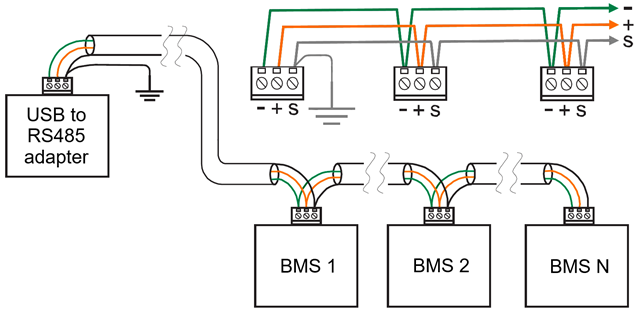
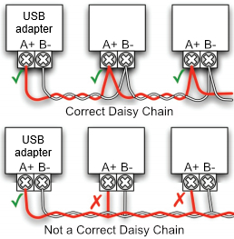
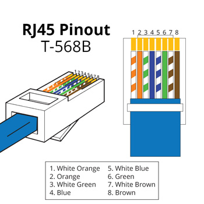
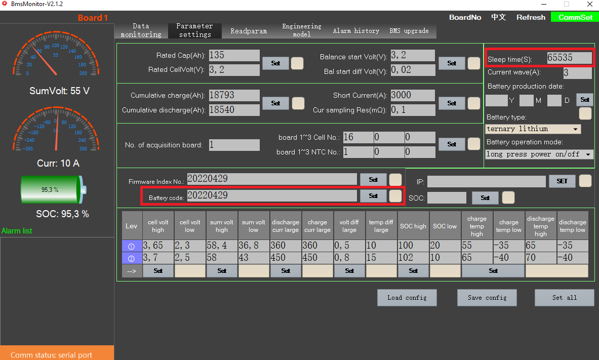

# How to connect and prepare the battery/BMS

> Make sure the data connection from the GX device to the BMS is isolated, see also [galvanic isolation](https://en.wikipedia.org/wiki/Galvanic_isolation).
> Otherwise you can damage your GX device and BMS, since the negative current will flow through the data cable, if the BMS disconnects the negative pole.

Since for some BMS the port labeling is a mess and not reflecting the real situation here are some useful instructions and links.

## How to correctly daisy chain via RS485/Modbus

> Refer to the [feature comparison](./features.md#bms-feature-comparison) to see which BMS models support this feature.

RS485 is a differential balanced line over twisted pair, capable of spanning up to a few hundred meters. Be aware of voltage drops due to cable resistance and sensor power consumption.

Connect the wires in a point-to-point (daisy chain) configuration:

- **Avoid star or ring networks** to prevent signal reflections.
- The main cable runs from the master (USB to RS485 adapter) to all BMS and contains three wires:
  - **A (DATA-)**
  - **B (DATA+)**
  - **GND (common)** for proper reference

The main cable should be shielded. Ideally, the shield is separate from the 0 Volt line (GND), but they can be combined if the shield is free of voltage fluctuations.

Use a termination resistor (120-130 Ω) between A (DATA-) and B (DATA+) if the line is longer than 10 meters.

See also [this page](https://know.innon.com/howtowire-non-optoisolated).

## How to correctly connect via CAN

> Refer to the [feature comparison](./features.md#bms-feature-comparison) to see which BMS models support this feature.

First, you need to create the correct cable.

### Victron Side

Refer to the [VE.Can to CAN-bus BMS cables manual](https://www.victronenergy.com/live/battery_compatibility:can-bus_bms-cable#pin-out) for instructions.

⚠️ Remember to use a 120 Ω resistor between CAN-H and CAN-L, or use a [VE.Can RJ45 Terminator](https://www.victronenergy.com/accessories/ve-can-rj45-terminator) to terminate the line on one end. Otherwise, it won't work.

| Function | Victron VE.Can Side | RJ45 Pinout T-568A | RJ45 Pinout T-568B |
| ---      | ---                 | ---                | ---                |
| GND      | Pin 3               | White/Orange       | White/Green        |
| CAN-H    | Pin 7               | White/Brown        | White/Brown        |
| CAN-L    | Pin 8               | Brown              | Brown              |

 

### BMS Side

Check your BMS manual for the correct pinout. If you don't find any, you could try to measure the voltages.

| Function | Voltage to GND |
| ---      | ---:           |
| GND      | 0 V            |
| CAN-H    | +3 V           |
| CAN-L    | +2 V           |

## Daly BMS

Connect your BMS via the PC software ([BmsMonitor](https://www.dalybms.com/download-pc-software/)) and set the `Sleep time(S)` to `65535` to prevent the BMS from going to sleep.

If you are using multiple batteries you also have to make sure, that the `Battery code` is different on every battery.

## Daren 485

See [daren-485](https://github.com/cpttinkering/daren-485) on GitHub.

## EG4 LiFePower

Also valid for:

### |- Revov

### |- TianPower

For EG4 LiFePower batteries, you need to set your DIP switch pins to 1 for the battery connected to the Cerbo GX.

## JKBMS

The JKBMS unfortunately has a wrong labeling. Here the correct pinout.

See also [JK BMS JK-B2A8S20P RS-485 port / connector](https://github.com/Louisvdw/dbus-serialbattery/discussions/250) and [New JKBMS "JK_DZ11B1A24S" (balancer only)](https://github.com/Louisvdw/dbus-serialbattery/discussions/578).

## JKBMS PB Model (also know as JK Inverter BMS)

> 🌼🔗 Only if you want to connect multiple JKBMS PB BMS to the same RS485 adapter 👇

1. Give each battery a unique address using the jumper on the front. Do not use `_ _ _ _`, which corresponds to address `0x00`,
  as it sets the BMS into master mode, disabling RS485 communication. Then specify the MODBUS addresses in the `config.ini` at
  the `MODBUS_ADDRESSES` parameter.

  For example, if you are using three batteries (battery 1 dip switches: `1: ON, rest off`, battery 2 dip switches: `1: OFF, 2: ON, rest off`, battery 3 dip switches: `1: ON, 2: ON, rest off`) the parameter would be `MODBUS_ADDRESSES = 0x01, 0x02, 0x03`.

  | Dip switch position | MODBUS address |
  | :---:               | :---:          |
  | `1 2 3 4`           |                |
  | `_ _ _ _`           | `0x00`         |
  | `‾ _ _ _`           | `0x01`         |
  | `_ ‾ _ _`           | `0x02`         |
  | `‾ ‾ _ _`           | `0x03`         |
  | `_ _ ‾ _`           | `0x04`         |
  | `‾ _ ‾ _`           | `0x05`         |
  | `_ ‾ ‾ _`           | `0x06`         |
  | `‾ ‾ ‾ _`           | `0x07`         |
  | `_ _ _ ‾`           | `0x08`         |
  | `‾ _ _ ‾`           | `0x09`         |
  | `_ ‾ _ ‾`           | `0x0A`         |
  | `‾ ‾ _ ‾`           | `0x0B`         |
  | `_ _ ‾ ‾`           | `0x0C`         |
  | `‾ _ ‾ ‾`           | `0x0D`         |
  | `_ ‾ ‾ ‾`           | `0x0E`         |
  | `‾ ‾ ‾ ‾`           | `0x0F`         |

2. Use a ethernet/CAT cable to connect all batteries via the RS485-2 ports. Both RS485-2 ports can be used.

3. Connect the first battery to your Cerbo/Raspberry using the RS485 to USB cable that came with the BMS.

4. In the JKBMS App ensure that the UART Protocol is set to the default `0/1`.

5. Reboot the system to apply the changes.

See also [Is anyone using the new style JK inverter BMS with dbus-serialbattery driver?](https://github.com/Louisvdw/dbus-serialbattery/discussions/969#discussioncomment-10987091).

## Renogy

> 🌼🔗 Only if you want to connect multiple Renogy BMS to the same RS485 adapter 👇

1. Connect all batteries to the RS485 battery monitor or the BT2 to give the batteries individual addresses.

2. Disconnect the batteries from the RS485 battery monitor or the BT2 and connect them to the USB to RS485 adapter which is connected to the GX device.

3. Specify the MODBUS addresses in the `config.ini` at the `MODBUS_ADDRESSES` parameter.

  For example, if you are using three batteries the parameter would be `MODBUS_ADDRESSES = 0x30, 0x31, 0x32`.

  | Battery count | MODBUS address |
  | :---:         | :---:          |
  | `1`           | `0x30`         |
  | `2`           | `0x31`         |
  | `3`           | `0x32`         |
  | `4`           | `0x33`         |
  | `5`           | `0x34`         |
  | `6`           | `0x35`         |
  | `7`           | `0x36`         |
  | `8`           | `0x37`         |
  | `9`           | `0x38`         |
  | `10`          | `0x39`         |
  | `11`          | `0x3a`         |
  | `12`          | `0x3b`         |
  | `13`          | `0x3c`         |
  | `14`          | `0x3d`         |
  | `15`          | `0x3e`         |
  | `16`          | `0x3f`         |

See also [Renogy - Multi battery setup documentation](https://github.com/Louisvdw/dbus-serialbattery/issues/1099).
